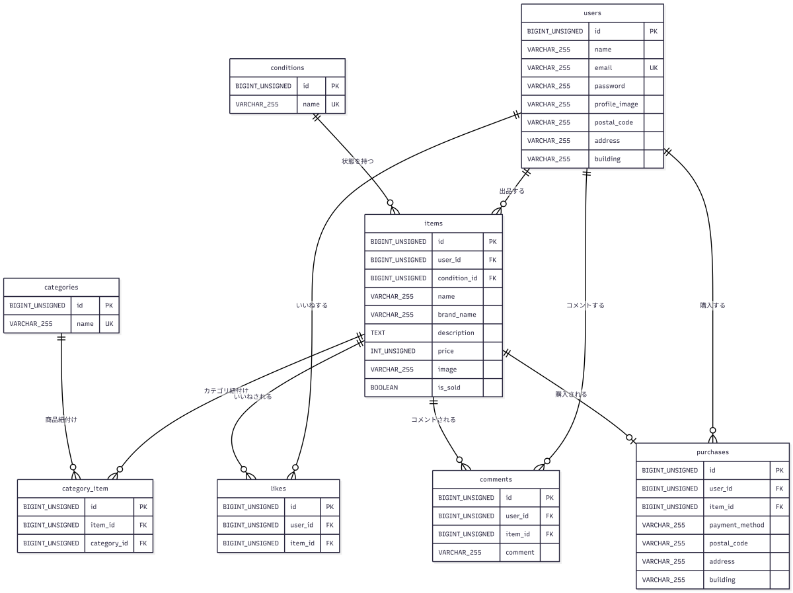

# coachtechフリマアプリ

## アプリケーション概要

coachtechフリマアプリは、ユーザーが商品の出品・閲覧・いいね・コメント・購入を行えるフリマアプリです。

会員登録後はメール認証を行い、認証済みユーザーのみが出品・購入・コメント・いいね・マイページ機能を利用できます。  
購入時にはStripe Checkoutを使用し、テスト環境上でカード決済画面へ遷移します。

## 主な機能

- 会員登録
- ログイン
- ログアウト
- メール認証
- 認証メール再送
- 商品一覧表示
- マイリスト表示
- 商品名・ブランド名による検索
- 商品詳細表示
- いいね追加・解除
- 売り切れ商品へのいいね制限
- コメント投稿
- 売り切れ商品へのコメント制限
- 商品購入
- Stripe Checkout決済
- 配送先住所変更
- マイページ表示
- プロフィール編集
- プロフィール画像削除
- 商品出品
- 出品商品の削除

## 使用技術

| 技術 | バージョン |
| --- | --- |
| PHP | 8.2 |
| Laravel | 10.x |
| MySQL | 8.0.26 |
| nginx | 1.21.1 |
| Docker | - |
| Docker Compose | - |
| Laravel Fortify | - |
| Stripe PHP SDK | v21.0.0 |
| MailHog | - |


## ER図



## 環境構築

### Dockerビルド

```bash
git clone git@github.com:m-iseda-GH/coachtech-freemarket.git
cd coachtech-freemarket
docker-compose up -d --build
```

### Laravel環境構築

PHPコンテナに入ります。

```bash
docker-compose exec php bash
```

Composerパッケージをインストールします。

```bash
composer install
```

`.env.example` をコピーして `.env` を作成します。

```bash
cp .env.example .env
```

アプリケーションキーを作成します。

```bash
php artisan key:generate
```

マイグレーションを実行します。

```bash
php artisan migrate
```

シーディングを実行します。

```bash
php artisan db:seed
```

ストレージリンクを作成します。

```bash
php artisan storage:link
```

## .env設定

`.env` のDB設定は以下のように設定してください。

```env
DB_CONNECTION=mysql
DB_HOST=mysql
DB_PORT=3306
DB_DATABASE=laravel_db
DB_USERNAME=laravel_user
DB_PASSWORD=laravel_pass
```

アプリケーションURLは以下を設定してください。

```env
APP_URL=http://localhost
```

メール認証の確認にはMailHogを使用します。

```env
MAIL_MAILER=smtp
MAIL_HOST=mailhog
MAIL_PORT=1025
MAIL_USERNAME=null
MAIL_PASSWORD=null
MAIL_ENCRYPTION=null
MAIL_FROM_ADDRESS="hello@example.com"
MAIL_FROM_NAME="${APP_NAME}"
```

Stripe Checkoutを使用するため、StripeのテストAPIキーを設定してください。

```env
STRIPE_KEY=pk_test_xxxxxxxxxxxxxxxxxxxxx
STRIPE_SECRET=sk_test_xxxxxxxxxxxxxxxxxxxxx
```

※ `.env.example` にはStripeキーの項目のみ用意し、実際のキーは `.env` に設定してください。  
※ `STRIPE_SECRET` は秘密鍵のため、GitHubなどに公開しないでください。  
※ 公開可能キーである `STRIPE_KEY` も、READMEやGitHubには実値を記載しないでください。

## 開発環境URL

| 項目 | URL |
| --- | --- |
| 商品一覧画面 | http://localhost/ |
| 会員登録画面 | http://localhost/register |
| ログイン画面 | http://localhost/login |
| phpMyAdmin | http://localhost:8080/ |
| MailHog | http://localhost:8025/ |

## URL一覧

| 画面 | URL |
| --- | --- |
| 商品一覧 | `/` |
| マイリスト | `/?tab=mylist` |
| 会員登録 | `/register` |
| ログイン | `/login` |
| メール認証 | `/email/verify` |
| 商品詳細 | `/item/{item_id}` |
| 商品購入 | `/purchase/{item_id}` |
| 住所変更 | `/purchase/address/{item_id}` |
| 商品出品 | `/sell` |
| マイページ | `/mypage` |
| 購入した商品一覧 | `/mypage?page=buy` |
| 出品した商品一覧 | `/mypage?page=sell` |
| プロフィール編集 | `/mypage/profile` |

## 主な処理用URL

| 処理 | メソッド | URL |
| --- | --- | --- |
| 会員登録 | POST | `/register` |
| ログイン | POST | `/login` |
| ログアウト | POST | `/logout` |
| 認証メール再送 | POST | `/email/verification-notification` |
| メール認証完了 | GET | `/email/verify/{id}/{hash}` |
| いいね追加・解除 | POST | `/item/{item_id}/like` |
| コメント投稿 | POST | `/item/{item_id}/comment` |
| Stripe Checkout開始 | POST | `/purchase/{item_id}` |
| Stripe決済成功 | GET | `/purchase/{item_id}/success` |
| Stripe決済キャンセル | GET | `/purchase/{item_id}/cancel` |
| 住所変更 | POST | `/purchase/address/{item_id}` |
| 商品出品 | POST | `/sell` |
| プロフィール更新 | POST | `/mypage/profile` |
| 商品削除 | DELETE | `/item/{item_id}` |

## 初期データ

Seederにより、以下の商品データが登録されます。

- 腕時計
- HDD
- 玉ねぎ3束
- 革靴
- ノートPC
- マイク
- ショルダーバッグ
- タンブラー
- コーヒーミル
- メイクセット

初期商品は `seller@example.com` の出品商品として登録されます。

## 動作確認用ユーザーの作成

必要に応じて、以下のコマンドでメール認証済み・住所登録済みの動作確認用ユーザーを作成できます。

```bash
docker-compose exec php php artisan tinker
```

Tinker内で以下を実行します。

```php
use App\Models\User;
use Illuminate\Support\Facades\Hash;

User::updateOrCreate(
    ['email' => 'check-final@example.com'],
    [
        'name' => '動作確認ユーザー',
        'password' => Hash::make('password123'),
        'postal_code' => '123-4567',
        'address' => '東京都渋谷区テスト1-2-3',
        'building' => 'テストマンション101',
        'email_verified_at' => now(),
    ]
);
```

Tinkerを終了します。

```php
exit
```

作成後、以下の情報でログインできます。

| 項目 | 値 |
| --- | --- |
| メールアドレス | check-final@example.com |
| パスワード | password123 |

## メール認証について

会員登録後、メール認証画面に遷移します。  
認証メールはMailHogで確認できます。

1. 会員登録を行う
2. `http://localhost:8025/` を開く
3. 認証メールを確認する
4. メール内の認証リンクをクリックする
5. プロフィール設定画面に遷移する

未認証ユーザーは、出品・購入・コメント・いいね・マイページ機能を利用できません。

## Stripe決済について

購入時にStripe Checkoutの決済画面へ遷移します。  
Stripe Checkoutではカード決済のテストを行います。

購入画面の支払い方法では「コンビニ支払い」または「カード支払い」を選択できます。  
Stripe Checkoutの動作確認時は「カード支払い」を選択してください。

テスト環境では以下のテストカードを使用してください。

| 項目 | 値 |
| --- | --- |
| カード番号 | 4242 4242 4242 4242 |
| 有効期限 | 任意の未来日 |
| CVC | 任意の3桁 |
| 名前 | 任意 |

決済が成功すると、購入情報が保存され、商品がSold状態になります。  
決済をキャンセルした場合、購入情報は保存されません。

## 補足事項

- 商品画像は外部URLまたはLaravelのstorageに保存された画像を表示します。
- 出品時にアップロードした画像は `storage/app/public/items` に保存されます。
- プロフィール画像は `storage/app/public/profiles` に保存されます。
- 未ログイン状態でマイリストを開いた場合、ログイン案内を表示します。
- `.env` はGit管理に含めないでください。
- Stripeのシークレットキーを含む `.env` はGitHubに公開しないでください。